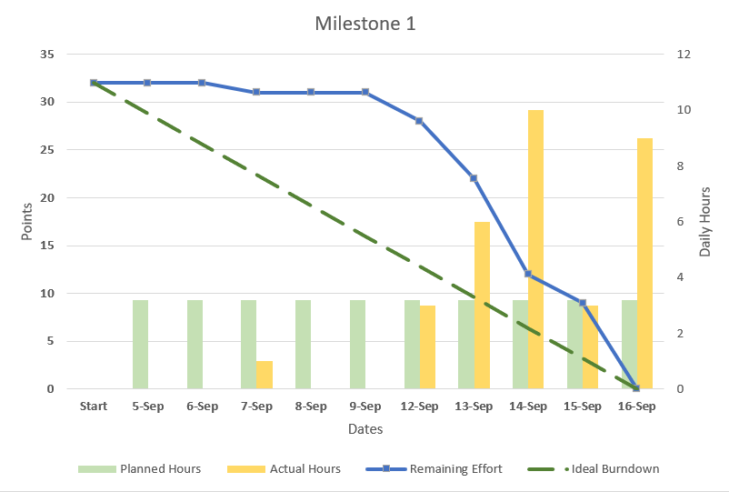
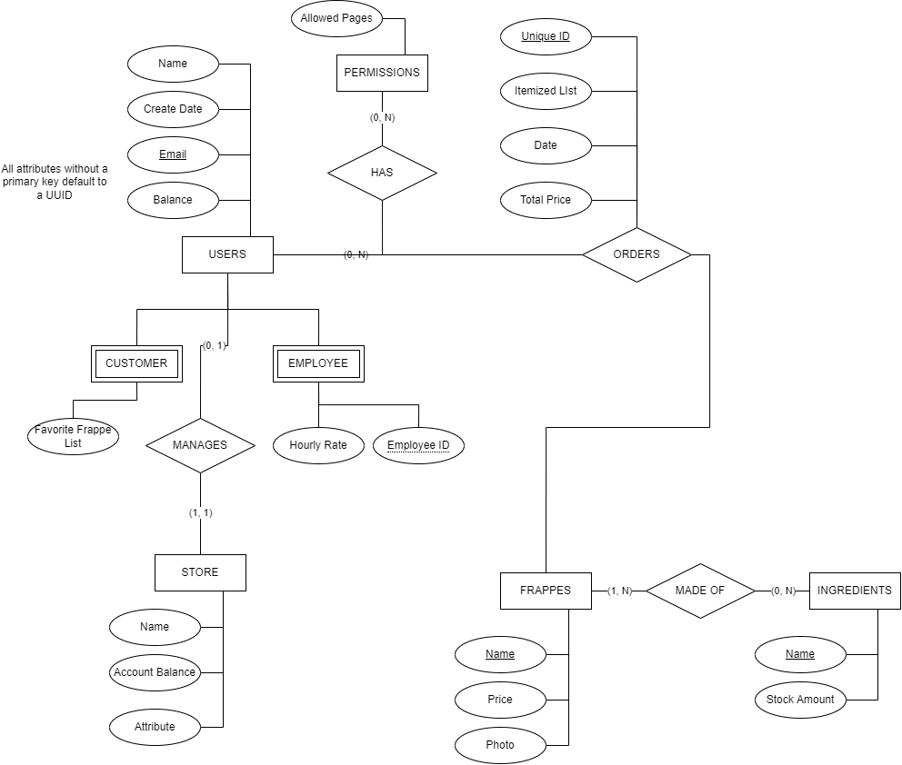
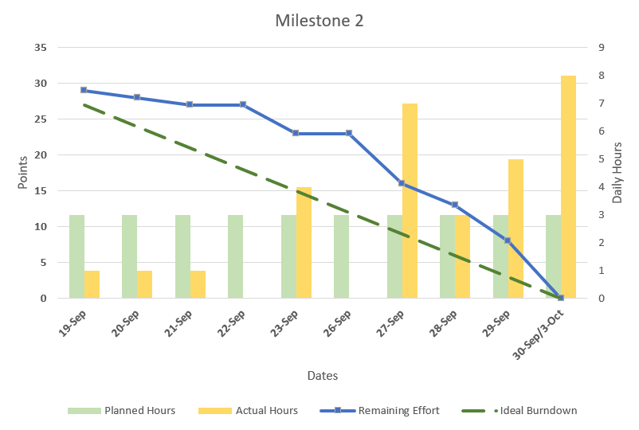

# Frappy

Frappy is a monolithic web app for managing a generic coffee shop catered towards millennials. For a more detailed overview, see [Project Plan](docs/Frappy_Project_Plan.docx) or [Requirements Definition](docs/requirement_definition.md)

## Team Members

- Dalyn Dalton
- Jacob Fitzgerald
- Spencer Peterson
- Dylan Spencer

## Grader Map

| Milestone | Location |
| :--- | ---: |
| Milestone 1 | [Documentation](docs/ ) |
| Milestone 2 | [Milestone 2](#milestone-2)

## Build Instructions

When pulling the repo down from Github, remove the package-lock.json file and run `npm install`

### Installation Requirements

```version
python3 >=3.10
node    >=16.17
```

### Linux

If running a *nix system, use the provided `build.sh` script.

### Windows

On windows, run the included `build.pwsh` script.

The script will automatically pull any needed dependencies or smaller packages.
Each script may prompt you for the required passwords or user accounts.

In the future, this will be migrated over to a docker compose file to allow for a single command build.

## Table of Contents

[Documentation](docs/ ) - Contains the project documentation and references.

[Source](src/) - Project Code

## Version Control

Version control will take place through github using git.  New features / bugs will be addressed as issues, which will then be assigned out.  Completed features and bug fixes will be submitted though forks relating to the specific issues referenced.

## Stack overview

For our project, we will be using a custom stack consisting of React, Django, and Postgres (RPD)

This can be expanded during production to a NGINX, Gunicorn, Django host.

- Django - Provides the REST API, user authentication, and serves static files via a reverse proxy with NGINX.
- React - Provides a front end framework for building web and mobile applications, and allows us to fetch page specific javascript allowing for a simple to use SPA.
- Postgres - A free to use robust relational database.

## Testing

Testing is performed using JEST and pytest and can be run using

```powershell python runtests.py```

```npm test```

## Burndown Chart



## Milestone 2

### Class Diagram



## Link to Wireframes (low-level prototype)

<https://www.figma.com/proto/fefIrPhFVDjBRaiS6Jyh3U/FRAPPY-MANAGER-PAGES?node-id=22%3A191&scaling=scale-down&page-id=0%3A1>

## Burndown Chart



## Activity Diagrams
[Customer Orders a Drink](docs/images/order_drink.png)

[Manager Creates a New Drink](docs/images/manager_creates_new_drink.png)
