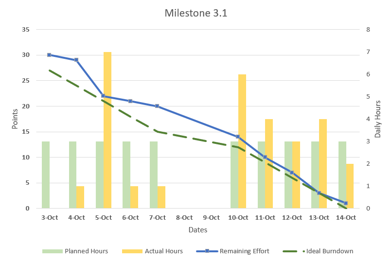
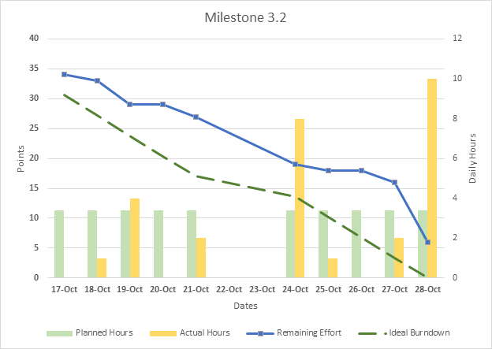
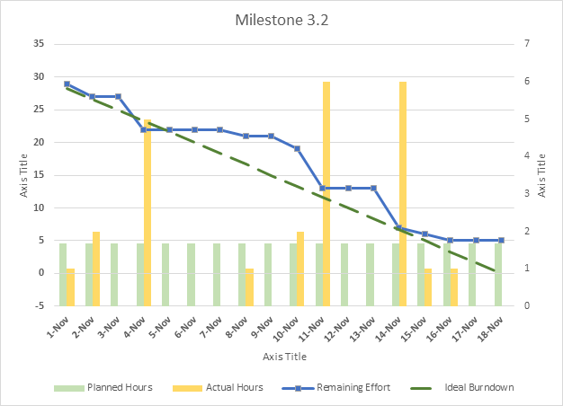
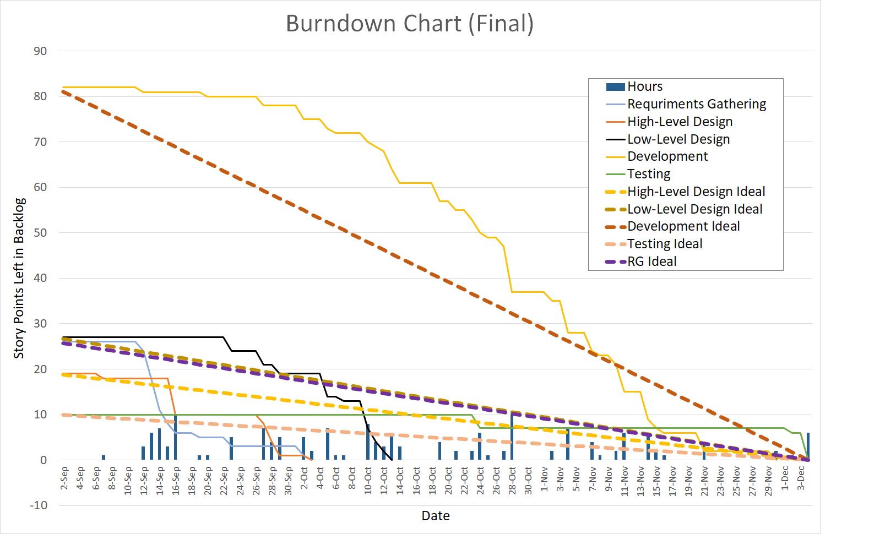

# Frappy


Frappy is a monolithic web app for managing a generic coffee shop catered towards millennials. For a more detailed overview, see [Project Plan](docs/Frappy_Project_Plan.docx) or [Requirements Definition](docs/requirement_definition.md)

## Team Members

- Dalyn Dalton
- Jacob Fitzgerald
- Spencer Peterson
- Dylan Spencer

## Grader Map

| Milestone | Location |
| :--- | ---: |
| Docs | [Documentation](docs/ ) |
| Milestone 1 | [Milestone 1](#milestone-1)
| Milestone 2 | [Milestone 2](#milestone-2) |
| Milestone 3 | [Milestone 3](#milestone-3) |
| Milestone 4 | [Milestone 4](#milestone-4) | 

# Notes for Grader

* We kept in the outdated build artifacts from earlier milestones. In order to run/test the project follow the directions in milestone 4. 
* The updated requirments doc can be found [here](docs/requirement_definition.md)
* Updated build instructions can be found [here](#final-build-instructions)
* Updated testing instructions can be found [here](#final-testing-instructions)
* The powerpoint can be found [here](docs/final/presentation)
* The powerpoint can also be found in google slides [here](https://docs.google.com/presentation/d/1w83QvGygz_2AjRGx_9o8IB-GTGtXUuaGXM6iYk-Igvw/edit?usp=sharing) (The videos in both powerpoints are google drive links)
* The videos can be found [here](docs/final/videos)
* The final burndown chart can be found [here](#full-project-burndown-chart)


# Milestone 1

## Build Instructions

When pulling the repo down from Github, remove the package-lock.json file and run `npm install`

### Installation Requirements

```version
python3 >=3.10
node    >=16.17
```
## Table of Contents

[Documentation](docs/ ) - Contains the project documentation and references.

[Source](src/) - Project Code

[Frontend](src/frontend/src)

[Backend](src/backend/frappy)

## Version Control

Version control will take place through github using git.  New features / bugs will be addressed as issues, which will then be assigned out.  Completed features and bug fixes will be submitted though forks relating to the specific issues referenced.

## Stack overview

For our project, we will be using a custom stack consisting of React, Django, and Postgres (RPD)

This can be expanded during production to a NGINX, Gunicorn, Django host.

- Django - Provides the REST API, user authentication, and serves static files via a reverse proxy with NGINX.
- React - Provides a front end framework for building web and mobile applications, and allows us to fetch page specific javascript allowing for a simple to use SPA.
- Postgres - A free to use robust relational database.

## Testing

Testing is performed using JEST and pytest and can be run using

```powershell python runtests.py```

NOT YET IMPLEMENTED:
```npm test```

## Burndown Chart


## Milestone 2

### Class Diagram


### Link to Wireframes (low-level prototype)

<https://www.figma.com/file/fefIrPhFVDjBRaiS6Jyh3U/FRAPPY-MANAGER-PAGES?node-id=0%3A1>

### Burndown Chart


### Activity Diagrams

[Customer Orders a Drink](docs/images/order_drink.png)

[Manager Creates a New Drink](docs/images/manager_creates_new_drink.png)

## Milestone 3

Milestone 3 contains the first working demo of our project, however the "scalable" stack involves many separate processes to get up and running.  To get started follow the instructions below.

### Running the Project

#### Requirements

- NodeJS >16
- Python >3.9
- Docker Destkop

To build and run the frontend, navigate to `/src/frontend` and run

```node
npm install
npm start
```

To build and run the backend web server, follow the instructions inside `/src/server`'s [README.md](/src/server/README.md).  This will guide you through creating a virtual environment that our init script can use to build and link the server and database.

After both frontend and backend servers are running, head over to the link specified in your NPM terminal to open and view the website.

#### Testing

To run server side testing, navagate to `/src/server/frappy` with your virtual environment activated. 

Run:
```
python manage.py test
```

This will create a temp database and prefill it with test data.

### Milestone 3.1



### Milestone 3.2



### Milesonte 3.3



## Milestone 4

### Full Project Burndown Chart


### Final Build Instructions

#### Requirements

- NodeJS >16
- Python >3.9
- Docker Destkop

#### Frontend
To build and run the frontend, navigate to `/src/frontend` and run

```node
npm install
npm start
```

To access the website, navigate to [http://localhost:3000/](http://localhost:3000/).

Login using the credentials [below](#user-accounts).

(Make sure the backend is currently running).


#### Backend

To build and run the backend web server, follow the instructions inside `/src/server`'s [README.md](/src/server/README.md).  This will guide you through creating a virtual environment that our init script can use to build and link the server and database.

After both frontend and backend servers are running, head over to the link specified in your NPM terminal to open and view the website.

### Final Testing Instructions

#### Frontend

To run the frontend side testing, navigate to `src/frontend/`.

Run:
```
npm test
```

#### Backend 

To run server side testing, navagate to `/src/server/frappy` with your virtual environment activated. 

Run:
```
python manage.py test
```

### User Accounts

```
Manager Account:
- email: admin@admin.com
- password: admin

Customer Account
- email: test@customer.com
- password: test@test

Cashier Account: 
- email: test@cashier.com
- password: test@test.com
```
