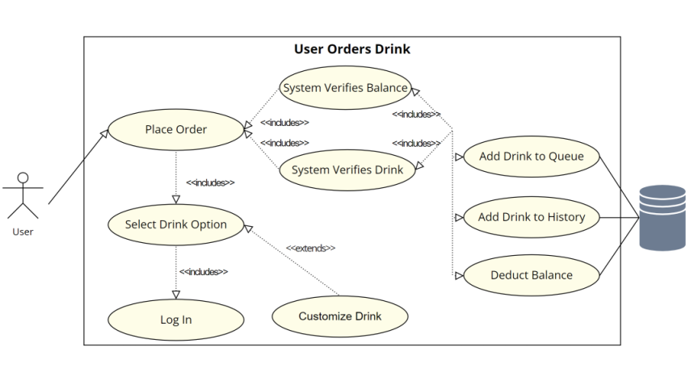
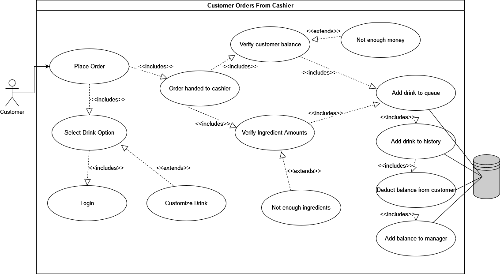
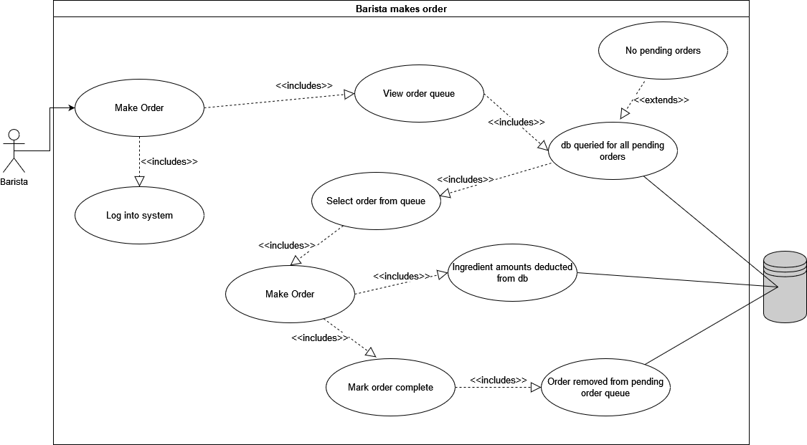
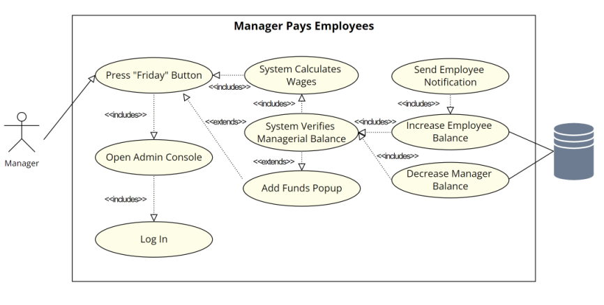

# Requirements Definition

> Group 13 -- Dan's Frappy shoppe

## Introduction and Context

Due to the recent explosion in popularity, Dan's Frappicino shop, *Frappy's* has been experiencing a massive increase in customers and orders. In addition to this, they've also needed to hire a large number of new employees to manage these orders, which their payment system is having trouble managing, and are constantly running out of inventory for their favorite products. Overall, this has slowed down Frappy's growth, and led to a decreased overall customer experience, with customers experiencing unreasonable wait times or being unable to purchase their favorite drinks. The goal of this project is to create a web-based application to solve these systems by allowing customers to place orders online, while also allowing managers to oversee staff and inventory.

A customer will be able to create a custom order for their drink ahead of time, reducing the time needed for Frappy's to process their order as well as saving the Customer time by avoiding having them wait in line. Drinks will be choosable via a variety of customizable presets or be buildable from the ground up via a "create-your-own" option. The system will allow customers to pay via their registered account balance, reducing payment fees and encouraging customer spending via a prepurchased "gift card" system. Additionally, the account system will allow customer's and Frappy's to track order history. This should allow customers more convenient access to their favorite drinks, and give Frappy's a better ability to estimate inventory trends.

Baristas will be able to use the system to view a queue of available drinks, reducing downtime, and increasing productivity by allowing them to optimize the order of drink creation. This will also allow them to mark orders as complete, letting the customer know their order is done immediately.

Cashiers will be able to use the system in order to place an order on behalf of a specific customer, drawing funds from the customer's balance. This should allow customers to order in-store if they forgot to order beforehand online.

Managers will have admin-level access to the system, allowing them to track and manage other users' accounts and balances. Using this functionality, they will be able to automatically pay employees at the end of the week with minimal difficulty. Managers will also be able to edit the drink menu as they see fit, allowing them to adapt to shortages and respond to customer demands.

All employees should be able to log their hours worked. This will assist in the automated payment system, and reduce the overhead of using a ticket system.

## Users and their Goals

The users of this system can be divided into two main categories: customers and employees. Customers will use the system to place orders, and should only be able to interact with their own accounts. Employees, which can further be subdivided into cashiers, baristas, and managers, will use the system to process orders, track work time, manage payments, and manage inventory. Employee access to account information should be broader than customer's, following a principle of least privilege.

### All Users

Functions available to all users of the web application include:

1. Account Creation
   * Default Option Presented to Users Who are Not Currently Signed In
   * Requires Unique Username
   * Requires Password
   * Password Should Pass Some Level of Minimum Security

2. Sign In
   * Default Option Presented to Users Who are Not Currently Signed In
   * Requires Username
   * Requires Matching Password

### Customers

Functions available to customers include:

1. Customize and Order Drinks
   * Several Modifiable Preset Options
   * "Build-Your-Own" Option
   * Paid for Using Account Balance
   * Drink Order Will Go Through if Drink Options are Valid and Account Contains Sufficient Balance
   

   

   > **Participating actor: Customer**
   >
   > **Entry conditions:**
   >
   > * Customer wants to order a drink
   >
   > **Exit Conditions:**
   >
   > * Customer leaves page without ordering
   > * Customer orders drink
   >
   > **Event Flow:**
   >
   >    1. Customer logs into website
   >    2. Customer selects from premade drink options or make your own
   >    3. Customer customizes drink (optional)
   >    4. Customer submits order
   >    5. Order handed to cashier
   >    6. Customer balance and ingedrient amounts verified
   >    7. Drink added to queue and order history
   >    8. Money deducted from customer and added to manager account

2. View Their Account Balance
   * Account Balance Will be Viewable Via a User Profile Button
   * An Add to Balance Button Will Allow Users to Top Off Their Balance Via Gift Cards

3. View Their Order History
   * Order History Will be Viewable Via a User Profile Button
   * Customers Will Have the Option to Create an Order Using a Past Order as a Preset

### All Employees

1. Log Hours Worked
   * Available Via a User Profile Button
   

### Cashiers

Functions Available to Cashiers Include:

1. Customize and Order Drinks on Behalf of a User
   * Option to Select from All Registered Users
   * Several Modifiable Preset Options
   * "Build-Your-Own" Option
   * Paid for Using Account Balance
   * Drink Order Will Go Through if Drink Options are Valid and Selected User Account Contains Sufficient Balance

### Baristas

Functions available to Baristas Include:

1. View Order Queue
   * Viewable Via a Unique Order Queue Button

2. Mark Orders as Completed
   * Via a Button in the Order Queue Screen

> **Participating actor: Barista**
>
> **Entry conditions:**
>
> * Barista attempts to make a drink
>
> **Exit Conditions:**
>
> * Barista finishes making drink
> * No drinks in queue
>
> **Event Flow:**
>
>    1. Barista logs in
>    2. Barista checks order queue
>    3. Barista selects order from queue
>    4. Barista makes order
>    5. Ingredient amounts deducted from db
>    6. Barista marks order complete
>    7. Order removed from pending order queue

### Managers

Functions available to Managers Include:

1. View and Manage Other Accounts
   * Available Via an Admin Panel
   * Can Mark Accounts as Different Roles (Except for Manager)
   * Can Change Account Balances

2. View and Manage Inventory
   * Available Via an Admin Panel
   * Can Add to Current Inventory Stock
   * Can Add New Items to Inventory?

3. Create New Drink Presets
   * Available Via an Admin Panel
   * Can Upload a Custom Image
   

4. Pay Employees
   * Available Via an Admin Panel
   * Automatically Transfers Balance from the Managers Account to Employees Accounts
   * Pays Employees Based on Hours Logged
   * Fails if Insufficient Funds are Available
   

## Functional Requirements

1. User Authentication and Access
   1. The system requires all users to authenticate themselves before giving them access to the system
      1. User will be able to Login with username/email and password
         1. If the account does not exist, the user will be redirected to the create an account option
      2. If User does not have an account, there will be a create an account option for the user
         1. Will only create customer accounts, Managers will be able to create other accounts and assign roles.
      3. Passwords will be encrypted
   2. User's can have different roles to have better access. Those roles include: Manager, Barista, Cashier, and Customers
      1. Users with Customer roles must have access to all Customer features. See Functional Requirement #3
      2. Users with Cashier roles must have access to all Customer and Cashier features. See Functional Requirement #4
      3. Users with Barista roles must have access to all Barista features. See Functional Requirement #5
      4. Users with Manager roles must have access to all features. See Functional Requirement #6
   3. If user does not want to create an account, there will be an 'Order as Guest' option to process order.
      1. Uses backup guest account login credentials

2. Menu/Inventory Features
   1. The ordering menu has a list of pre-made drinks to order
      1. Drinks are customizable and can add/remove ingredients
         1. When things are added/removed the price changes and so does the inventory
         2. Checks to see if there are sufficient ingredients in inventory to complete order
   2. The menu will have multiple sizes (small, medium, large)
      1. Amount of ingredients used will change depending on the size
   3. The price of the menu items will be based on the price of the ingredients used, with a profit margin
   4. The inventory will have all the different ingredients and other store items
      1. If empty, store can order more through the manager
      2. Each item will have a price used to calculate menu item prices

3. Customer Features
   1. All Users will have access to customer features
   2. Customer will have an account with money they can use to spend
      1. Customer can add as much money as needed to their account
   3. Has favorite drink option based on past orders
   4. Customer will be updated on order status while order is pending
   5. Customer can order online
      1. Will put their order in the queue for the Baristas
      2. Before order is processed, check customer account balance to make sure they have enough funds
      3. Orders can be for pickup or in-person

4. Cashier Features
   1. Cashier will have an account to keep earnings for hours worked
   2. Cashier has access to user accounts to make orders on behalf of customers
      1. Can use Guest accounts for customers that do not want to set up and account
      2. Accesses the account balance and transfers money from their account directly to manager
      3. Cashier can issue a refund if needed to user account
   3. Once order is placed cashier submits ticket to barista
   4. Cashier can submit the number of hours worked to get paid by manager
      1. Every time they submit hours, it adds to their current total of hours
      2. Their hours are reset upon payment
   5. Cashier can check the status of each ticket and places items for delivery once done

5. Barista Features
   1. Barista will have an account to keep earnings for hours worked
   2. Barista can submit the number of hours worked to get paid by manager
      1. Every time they submit hours, it adds to their current total of hours
      2. Their hours are reset upon payment
   3. Barista can accept a ticket that has been submitted to the queue.
   4. Barista can update the status of the orders in the queue
      1. Ticket can be in the waiting stage
      2. Ticket can be in the Processing stage
         1. Barista update the inventory for what is being used
         2. While drink is being made, updates progress bar for online customers and cashier
      3. Ticket can be in the Done phase
         1. Order gets sent back to cashier for distribution
         2. Order gets sent to pickup

6. Manager Features
   1. Manager will have the store account to give money to Baristas and Cashiers
      1. Will have access to a pay all button that pays money to employees for hours worked
         1. Once button is pushed, money is subtracted from manager account and all employee worked hours is reset
      2. Manager can add unlimited money to their account if needed
   2. Manager has the ability to hire/fire employees and remove user accounts
   3. Manager can edit the menu
      1. make new drinks
      2. delete drinks
      3. edit drinks in menu
      4. edit the price of the drinks
   4. Can add inventory items
      1. money is subtracted from the Managers/stores account
   5. Manager can do everything a cashier and Barista can

## Non-Functional Requirements

There exist several non-functional requirements for this project as well, namely:

1. The system must use a database
   1. The database should store account information for users, managers, cashiers, and baristas, including the following fields:
      1. Username
      2. Password (*Encrypted*)
      3. Account Balance
      4. Order History

   2. The database should store information on the store's current inventory, including the following fields:
      1. Type
      2. Quantity

2. The system should be deployable over the internet.
   1. Local hosting will also suffice.

3. The system should use a version control system.
   1. Git has been selected for this purpose.

4. Development will follow a hybrid mixture of the Agile method and Spiral process.
   1. Each 2-week phase will be composed of several smaller tasks
      1. Tasks will utilize a backlog and priority system
   2. Each phase will include risk analysis
   3. Any type of development can be done at any phase
   4. Each phase will end with a retrospective meeting

5. Deveopmers must meet frequently to discuss progress
   1. The SCRUM format will be used
   2. Stand Up's will be used
   3. SCRUM poker will be used

6. Developers must track progress of implementation via burndown charts.
   1. These will be updated at "daily" meetings.

## Future Features

This section contains a list of features that are beyond the scope of the project, but could be implemented
in future versions.

1. The site can be hosted on a hosting service to be used for an actual shop
2. Add more than just drink items to the menu to support food or other items
3. Add a delivery service with delivery ETA's
4. Add a Drink of the Day menu with discounted items on certain days of the week

## Glossary

This section contains a list of important terms and their definitions.

**Customer** - a user that uses the system to place an order

**Barista** - the user that oversees the process of completing the order to desire specs.

**Cashier** - the user that manages customer requests and see the completion of those requests

**Manager** - the user that manages the input and output flow of the shops money and daily operations.

**Drinks** - Any item in the menu that can be ordered.

**Account** - The information attached to a user that contains their monetary balance

**User** - refers to any of the four types of users of the system (Customers, Baristas, Cashiers,
Managers)

**System** - refers to the application that the project aims to build
