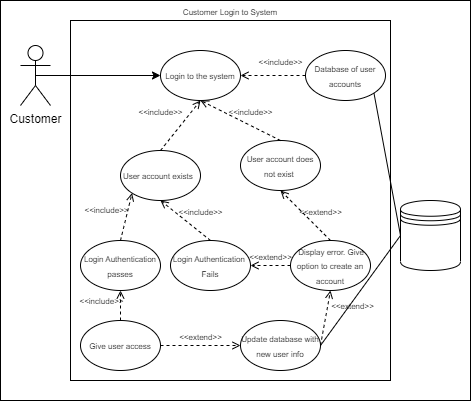
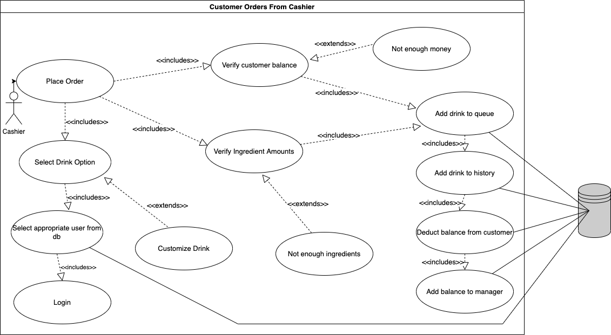
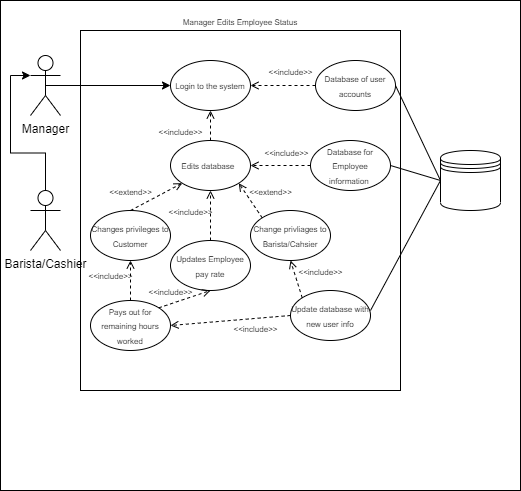

# Requirements Definition

> Group 13 -- Dan's Frappy shoppe

## Introduction and Context

Due to the recent explosion in popularity, Dan's Frappiccino shop, _Frappy's_ has been experiencing a massive increase in customers and orders. In addition to this, they've also needed to hire a large number of new employees to manage these orders, which their payment system is having trouble managing, and are constantly running out of inventory for their favorite products. Overall, this has slowed down Frappy's growth, and led to a decreased overall customer experience, with customers experiencing unreasonable wait times or being unable to purchase their favorite drinks. The goal of this project is to create a web-based application to solve these systems by allowing customers to place orders online, while also allowing managers to oversee staff and inventory.

A customer will be able to create a custom order for their drink ahead of time, reducing the time needed for Frappy's to process their order as well as saving the Customer time by avoiding having them wait in line. Drinks will be choosable via a variety of customizable presets or be buildable from the ground up via a "create-your-own" option. The system will allow customers to pay via their registered account balance, reducing payment fees and encouraging customer spending via a pre-purchased "gift card" system. Additionally, the account system will allow customer's and Frappy's to track order history. This should allow customers more convenient access to their favorite drinks, and give Frappy's a better ability to estimate inventory trends.

Baristas will be able to use the system to view a queue of available drinks, reducing downtime, and increasing productivity by allowing them to optimize the order of drink creation. This will also allow them to mark orders as complete, letting the customer know their order is done immediately.

Cashiers will be able to use the system in order to place an order on behalf of a specific customer, drawing funds from the customer's balance. This should allow customers to order in-store if they forgot to order beforehand online.

Managers will have admin-level access to the system, allowing them to track and manage other users' accounts and balances. Using this functionality, they will be able to automatically pay employees at the end of the week with minimal difficulty. Managers will also be able to edit the drink menu as they see fit, allowing them to adapt to shortages and respond to customer demands.

All employees should be able to log their hours worked. This will assist in the automated payment system, and reduce the overhead of using a ticket system.

## Users and their Goals

The users of this system can be divided into two main categories: customers and employees. Customers will use the system to place orders, and should only be able to interact with their own accounts. Employees, which can further be subdivided into cashiers, baristas, and managers, will use the system to process orders, track work time, manage payments, and manage inventory. Employee access to account information should be broader than customer's, following a principle of least privilege.

### All Users

Functions available to all users of the web application include:

1. Account Creation

   - Default Option Presented to Users Who are Not Currently Signed In
   - Requires Unique Email
   - Requires Password
   - Password Should Pass Some Level of Minimum Security

2. Sign In

   - Default Option Presented to Users Who are Not Currently Signed In
   - Requires Email
   - Requires Matching Password

   

   > **Participating Actors:** Customer
   >
   > **Entry Conditions:**
   >
   > - Customer opens up login page and inputs username and password
   >
   > **Exit Conditions:**
   >
   > - Customer Create a new account
   >
   > - Customer is redirected to error page to create an account
   >
   > - Customer successfully logs in
   >
   >   **Event Flow:**
   >
   > 1. Customer submits login information
   > 2. Customer is Authenticated by system
   > 3. System checks for user's credentials
   > 4. Login Authentication passes
   > 5. Login Authentication fails (or account does not exist)
   > 6. User is sent to error page to create an account
   > 7. Database is updated with new account info and sent back to step 1
   > 8. User is granted access to site

### Customers

Functions available to customers include:

1. Customize and Order Drinks

   - Several Modifiable Preset Options
   - Full Customization Options
   - Paid for Using Account Balance (Must Have Non-Negative Balance to Order)
   - Drink Order Will Go Through if Drink Options are Valid
     

2. View Their Account Balance

   - Account Balance Will be Viewable Via a User Profile Button
   - An Add to Balance Button Will Allow Users to Top Off Their Balance

3. View Their Order History
   - Order History Could be Viewable Via the Home Page
   - Customers Could Have the Option to Create an Order Using a Past Order as a Preset

### All Employees

1. Log Hours Worked
   - Available Via the Account Page
     

> **Participating actor: Employee**
>
> **Entry conditions:**
>
> - Employee logs in to add hours
>
> **Exit Conditions:**
>
> - Hours submitted successfully, employee paid
> - Incorrectly formatted hours, denied
>   **Event Flow:**
>
>   1.  employee logs in
>   2.  employee submits hours
>   3.  data is validated, either rejected or accepted
>   4.  hours are submitted to database
>   5.  employee is paid when manaker clicks the "button"

### Cashiers

Functions Available to Cashiers Include:

1. Customize and Order Drinks on Behalf of a User

   - Option to Enter User Email Adress
   - Several Modifiable Preset Options
   - Paid for Using Customer Account Balance
   - Drink Order Will Go Through if Drink Options are Valid and Selected User Account Contains Sufficient Balance

   

   > **Participating actor: Cashier**
   >
   > **Entry conditions:**
   >
   > - Customer wants to order a drink from cashier
   >
   > **Exit Conditions:**
   >
   > - Cashier empties cart and leaves page without ordering for customer
   > - Cashier orders drink on behalf of customer
   >
   > **Event Flow:**
   >
   > 1. Cashier logs into website
   > 2. Cashier selects from premade drink options
   > 3. Cashier customizes drink (optional)
   > 4. Cashier adds drink to cart
   > 5. Cashier verifies customer email
   > 6. Cashier submits order
   > 7. Customer balance and ingredient amounts verified
   > 8. Drink added to queue and order history
   > 9. Money deducted from customer and added to manager account

### Baristas

Functions available to Baristas Include:

1. View Order Queue

   - Viewable Via a Unique Order Queue Button

2. Mark Orders as Completed
   - Via a Button in the Order Queue Screen

> **Participating actor: Barista**
>
> **Entry conditions:**
>
> - Barista attempts to make a drink
>
> **Exit Conditions:**
>
> - Barista finishes making drink
> - No drinks in queue
>
> **Event Flow:**
>
> 1.  Barista logs in
> 2.  Barista checks order queue
> 3.  Barista selects order from queue
> 4.  Barista makes order
> 5.  Barista marks order complete
> 6.  Order removed from pending order queue

### Managers

Functions available to Managers Include:

1. View and Manage Other Accounts

   - Available Via an Accounts Tab
   - Can Mark Accounts as Different Roles (Except for Manager)

   

   > **Participating Actors:** Customer, Barista/Cashier (referred to as Employee)
   >
   > **Entry Conditions:**
   >
   > - Manager has already talked to Employee about change
   >
   > - Employee currently has an account with Frappy
   >
   > **Exit Conditions:**
   >
   > - Employee information is added
   >
   > - Employee information is changed
   >
   > - Employee pay is changed
   >
   >   **Event Flow:**
   >
   > 1. Manager logs into system
   > 2. Manager access the Employee database
   > 3. Manager edits Employee Status
   > 4. If the Employee is being removed
   > 5. Pays Employee from account for hours currently worked
   > 6. Changes account privileges and makes customer account
   > 7. If the Employee is being added
   > 8. Account privileges are upgraded to Barista or Cashier
   > 9. Given a pay rate of $15 per hour
   > 10. If the Employee's pay is getting changed
   > 11. Pays Employee from account for hours currently worked
   > 12. Changes pay rate to adjusted amount and Database is updated

2. View and Manage Inventory

   - Available Via an Inventory Tab
   - Can Add to Current Inventory Stock (Ordered With Balance)
   - Can Add New Items to Inventory

3. Create New Drink Presets

   - Available Via a Drink Tab
   - Could Upload a Custom Image

   

   > **Participating actor: Barista**
   >
   > **Entry conditions:**
   >
   > - manager attempts to add or edit a drink
   >
   > **Exit Conditions:**
   >
   > - drink is submitted successfully
   > - drink is invalid and error is returned
   >
   > **Event Flow:**
   >
   > 1. Manager logs in
   > 2. submits a drink
   > 3. Drink is rejected if it already exists or is invalid.
   > 4. Drink is submitted to database
   > 5. success message is returned

4. Pay Employees

   - Available Via the Manager Home Page
   - Automatically Transfers Balance from the Managers Account to Employees Accounts
   - Pays Employees Based on Hours Logged
   - Manager Can Take Out a Loan if They Have Insufficient Funds

   

   > **Participating actor: Manager**
   >
   > **Entry conditions:**
   >
   > - Manager Clicks Pay Employees Button
   >
   > **Exit Conditions:**
   >
   > - Payment Fails (Insufficient Funds)
   > - Payment Goes Through
   >
   > **Event Flow:**
   >
   > 1. Manager Logs In
   > 2. Manager Goes to Admin Console
   > 3. Manager Hits "Friday" Button
   > 4. System Validates Funds
   > 5. Funds are Transfered

## Functional Requirements

1. User Authentication and Access
   1. The system must have all users to authenticate themselves before giving them access to the system.
      1. User must have the ability to Login with email and password.
         1. If the account does not exist, the user should be redirected to the create an account option.
      2. If User does not have an account, the user must have the ability be a create an account.
         1. The system must only allow the user to create customer accounts. Managers must have the ability to create other accounts and assign roles.
      3. Passwords must be encrypted.
   2. User's could have different roles for different levels of access. Those roles include: Manager, Barista, Cashier, and Customers.
      1. Users with Customer roles must have access to all Customer features. See Functional Requirement #3.
      2. Users with Cashier roles must have access to all Customer and Cashier features. See Functional Requirement #4.
      3. Users with Barista roles must have access to all Barista features. See Functional Requirement #5.
      4. Users with Manager roles must have access to all features. See Functional Requirement #6.
   3. If user does not want to create an account, there could be an 'Order as Guest' option to process order.
      1. User should have the option to use this backup guest account login credentials.
2. Menu/Inventory Features
   1. The ordering menu must have a list of pre-made drinks to order
      1. Drinks must be customizable and have the ability to add/remove ingredients.
         1. When things are added/removed the price must change and so must the inventory.
         2. The system should check to see if there are sufficient ingredients in inventory to complete order.
   2. The menu must have multiple sizes (small, medium, large).
      1. Amount of base ingredients used should change depending on the size.
   3. The price of the menu items must be based on the price of the ingredients used, with a profit margin.
   4. The inventory must have all the different ingredients and other store items.
      1. If empty, the manager must have the ability to order more inventory items.
      2. Each item must have a price used to calculate menu item prices
3. Customer Features

   1. All Users must have access to customer features
   2. Customer must have an account with money they can use to spend
      1. Customer should have the ability to add as much money as needed to their account
   3. Customer must be updated on order status while order is pending
   4. Customer could have the option to order online
      1. The system must put their order in the queue for the Baristas
      2. Before order page is accessible, the system must check customer account balance to make sure they do not have a negative tab.
         1. If they have a negative tab, the system must not display the order page.
      3. Orders could be available for pickup or in-person orders.

4. Cashier Features

   1. Cashier must have an account to keep earnings for hours worked.
   2. Cashier must have access to customer accounts to make orders on behalf of customers.
      1. Cashier could have the ability to use Guest accounts for customers that do not want to set up and account.
      2. Cashier must have the ability to access the account balance and transfers money from their account directly to manager.
      3. Cashier could issue a refund if needed to user account.
   3. Once order is placed the cashier must be able to submit tickets to barista.
   4. Cashier must have the ability to submit the number of hours worked to get paid by manager.
      1. Every time they submit hours, the system must add it to their current total hours worked.
      2. The system must reset their hours upon payment.
   5. Cashier should have the ability to check the status of each ticket and places items for delivery once they are done.

5. Barista Features

   1. Barista must have an account to keep earnings for hours worked.
   2. Barista must have the ability to submit the number of hours worked to get paid by the manager.
      1. Every time they submit hours, the system must add it to their current total hours worked.
      2. The system must reset their hours upon payment.
   3. Barista must be able to handle an order that has been submitted to the queue.
      1. Barista must be able to view all orders in the queue and select an order
         1. Barista must be able to see all ingredients needed to complete the order
         2. Barista must check off all ingredients as they complete the order, and only then can they complete the order
         3. Barista Marks an order is completed which removes the drink from the pending queue

6. Manager Features
   1. Manager must have the store account to give money to Baristas and Cashiers.
      1. Manager must have access to a pay all button that pays money to employees for hours worked.
         1. Manager must be able to push button, where then the system must subtract money from manager account, distribute to employees, and all employee worked hours are reset.
      2. Manager must be able to add unlimited money to their account if needed.
   2. Manager must have the ability to hire/fire employees.
   3. Manager must be able to edit the menu by:
      1. make new drinks
      2. delete drinks
      3. edit drinks in menu
      4. could edit the price of the drinks
   4. Manager must be able to add inventory items
      1. The system must subtract money from the Managers/stores account
   5. Manager must be able to do everything a cashier and Barista can

## Non-Functional Requirements

There exist several non-functional requirements for this project as well, namely:

1. The system must use a database

   1. The database should store account information for users, managers, cashiers, and baristas, including the following fields: 2. Password (_Encrypted_) 3. Email 4. Account Balance 5. Order History

   2. The database should store information on the store's current inventory, including the following fields:
      1. Type
      2. Quantity
      3. Cost

2. The system should be deployable over the internet.

   1. Local hosting will also suffice.

3. The system should use a version control system.

   1. Git has been selected for this purpose.

4. Development will follow a hybrid mixture of the Agile method and Spiral process.

   1. Each 2-week phase will be composed of several smaller tasks
      1. Tasks will utilize a backlog and priority system
   2. Each phase will include risk analysis
   3. Any type of development can be done at any phase
   4. Each phase will end with a retrospective meeting

5. Developers must meet frequently to discuss progress

   1. The SCRUM format will be used
   2. Stand Up's will be used
   3. SCRUM poker will be used

6. Developers must track progress of implementation via burndown charts.
   1. These will be updated at "daily" meetings.

## Future Features

This section contains a list of features that are beyond the scope of the project, but could be implemented
in future versions.

1. The site can be hosted on a hosting service to be used for an actual shop
2. Add more than just drink items to the menu to support food or other items
3. Add a delivery service with delivery ETA's
4. Add a Drink of the Day menu with discounted items on certain days of the week

## Glossary

This section contains a list of important terms and their definitions.

**Customer** - a user that uses the system to place an order

**Barista** - the user that oversees the process of completing the order to desire specs.

**Cashier** - the user that manages customer requests and see the completion of those requests

**Manager** - the user that manages the input and output flow of the shops money and daily operations.

**Drinks** - Any item in the menu that can be ordered.

**Account** - The information attached to a user that contains their monetary balance

**User** - refers to any of the four types of users of the system (Customers, Baristas, Cashiers,
Managers)

**System** - refers to the application that the project aims to build
